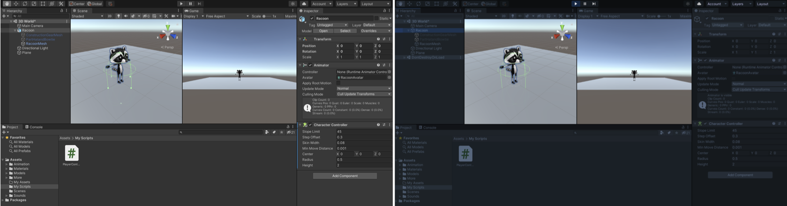
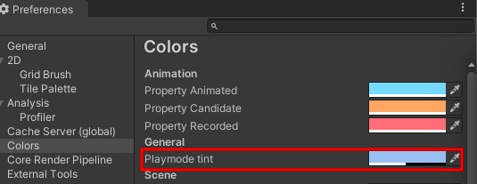

It is useful to add a colour tint to the editor whilst it is in Playmode. This makes it easy to tell whether your scene is running or not. 

To set a tint, go to the **Unity** menu and select **Preferences**. Choose the **Colours** menu and find the property called **Playmode tint**.

Click on the existing colour to see a colour wheel where you can choose a colour and opacity level.

Return to the Unity editor and press the **Play** button to see your new tint in action.
